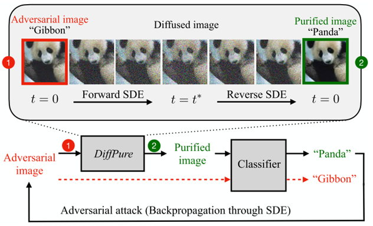

Title:  Diffusion Models for Adversarial Purification   
Date: 20220922
Category: paper
tags: paper, Adversarial, Diffusion, 

[TOC]

# 概述

在分类器前加扩散模型， 对输入样本通过加噪声再去噪的方式进行净化， 希望在去噪过程中把对抗信号给净化掉。

难点： 选取恰当的 t ，既能去掉对抗噪声信号， 又能保留原图片的标签或属性的信息

理论：
1. Theorem证明 对抗样本经过这样净化后， 变得更接近 干净数据的分布
2. Theorem说明 t 应该怎么选
3. Proposition 相应的 Adaptive attack

