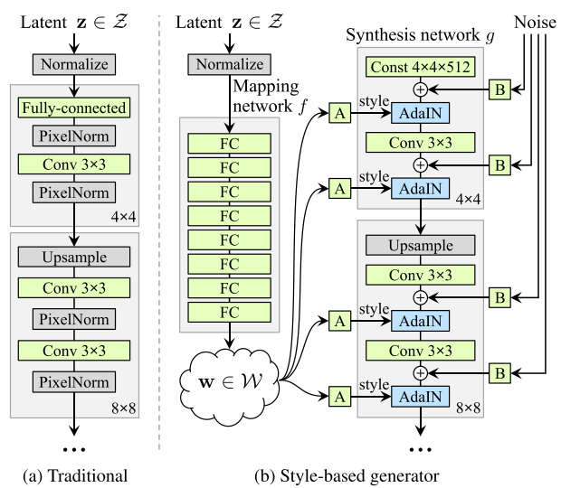

Title: StyleGAN: A Style-Based Generator Architecture for Generative Adversarial Networks
Date: 20220918
Category: paper
tags: paper, generator, GAN

[TOC]

# 概述

0. bilinear up/down sampling, 更长的训练， 调参
1. 应用 AdaIN 到 Progressive GAN
2. w = 8层MLP(z),  再用 A(w)->scale,bias of AdaIN
3. 移除过去的 z输入给conv， 变成 固定的
4. Noise 作为 stochastic variantion 控制细节变化
5. mixing regularization. 部分数据使用 style mixing生成的图片
   

