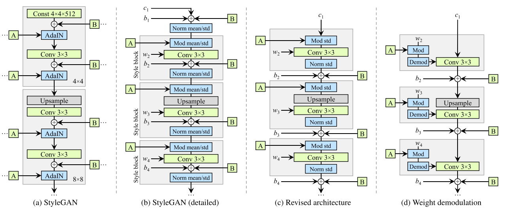

Title: StyleGAN2: Analyzing and Improving the Image Quality of StyleGAN
Date: 20220919
Category: paper
tags: paper, generator, GAN

[TOC]

# 概述
[[stylegan]]

## 归一化

缺点： 造成 blob 或 corrupted 的图片

方法： 移除 AdaIN里的bias， 即只保留 std

## Demodulation

移除 normalization操作， 转成 w -> w' = s w -> w'' = w'/ $\sqrt{\sum w'}$

## 正则化

PPL(perceptual path length)跟感知图像质量的关系

   
